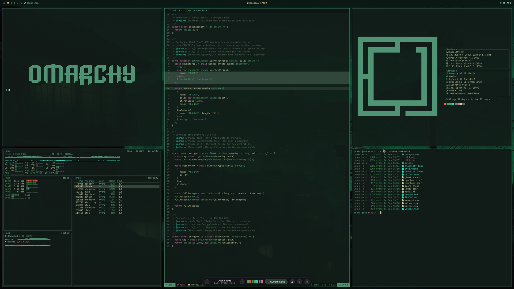

# Themes Explorer

An Omarchy bar widget that answers the question every theme switch asks: *what
will this actually look like?*

Clicking it opens a fullscreen simulated desktop — btop, fastfetch, `eza -l`,
Nautilus, LazyVim, Neovim, VS Code, the Omarchy menu and the bar itself — all
repainted live from a theme's real `colors.toml`. Arrow through your installed
themes, and apply the one you want without leaving the page.



## Install

```bash
omarchy plugin add https://github.com/mythz/omarchy-themes-explorer.git --enable
```

Pick the **right** bar section when prompted. Nothing is written outside
`~/.config/omarchy/plugins/mythz.themes-explorer` — the plugin is self-contained
and puts nothing on your `PATH`.

Remove it with `omarchy plugin remove mythz.themes-explorer`.

## Nesting it in the Omarchy menu

The bar icon is optional — you can reach it from the Omarchy menu instead, or as
well. Add a row to `~/.config/omarchy/extensions/omarchy-menu.jsonc`; the parent
is inferred from the dotted id, so `style.themes-explorer` nests under the
built-in **Style** submenu:

```jsonc
"style.themes-explorer": {
  "icon": "\uf1fc",
  "label": "Themes Explorer",
  "description": "Try on every installed theme against a simulated desktop",
  "aliases": ["themes", "theme explorer", "preview themes"],
  "action": "~/.config/omarchy/plugins/mythz.themes-explorer/bin/omarchy-themes-explorer",
  "when": "[ -x ~/.config/omarchy/plugins/mythz.themes-explorer/bin/omarchy-themes-explorer ]"
}
```

Use the literal paintbrush glyph for `icon` rather than the escape shown above.
The file hot-reloads on save. `when` is a bash test that hides the row if the
plugin is not installed, and `aliases` make it reachable with
`omarchy menu summon`, and searchable from the menu's filter.

Because the launcher toggles, picking the row a second time hides the app again,
exactly like the bar icon.

## Use

| | |
|---|---|
| Click the bar icon | Open, or hide it again |
| `←` `→` | Previous / next theme |
| Hover the theme name | Jump straight to any installed theme |
| `Enter` | Apply the theme you are looking at |
| Right-click a panel | Swap the app shown there |
| `Esc` or `✕` | Hide — returns to exactly the layout you left |
| `Super + W` | Quit the app entirely |
| `?` | Full key list |

Right-clicking the bar icon opens it in a normal browser tab instead, which is
handy for taking screenshots.

## How it works

Python's standard library serves the page and reads the themes; there are no
dependencies to install beyond what Omarchy already ships.

**Palettes.** Themes are read straight from `~/.config/omarchy/themes` and
`/usr/share/omarchy/themes`, and `colors.toml` is normalised across all three
dialects in the wild — named keys, `color0`–`color15`, and the older layout
where the palette only exists in `alacritty.toml`. Window border colours come
from `colors.toml`'s `hyprland_active_border`/`hyprland_inactive_border` the way
Omarchy's own `hyprland.lua` template reads them, btop is read from the theme's
`btop.theme` (falling back to Omarchy's template mapping), and the Nautilus
folder tint comes from its `icons.theme`.

What a theme does **not** decide is worth knowing, because it is where a preview
most easily lies:

- **Corner radius is Omarchy's, not the theme's.** Every theme's staged
  `hyprland.lua` is generated from `default/themed/hyprland.lua.tpl`, which sets
  border colours and nothing else — and a git-installed theme may not supply Lua
  at all. A `rounding` in a theme's own `hyprland.conf` is never read; what runs
  is `default/hypr/looknfeel.lua`, which is square.
- **Nautilus does not wear the theme either.** `omarchy-theme-set-gnome` only
  flips GTK between stock Adwaita and Adwaita-dark on the theme's mode and points
  the icon theme at its `icons.theme`. A theme's `gtk.css` is never staged, so
  the file manager is Adwaita grey with theme-coloured folders.
- **fastfetch draws its logo in ANSI green**, per its `"color": {"1": "green"}` —
  not in the accent.

**The window never touches your layout.** It opens on its own special
workspace, `special:themes-explorer` — a dedicated scratchpad, not Omarchy's
shared one on `Super+S`, so it never disturbs what you keep in that.

The placement is a **window rule applied when the window maps**, not a move
afterwards, and that distinction is the whole thing. Moving is too late: the
window has already mapped into your current workspace, dwindle has already
re-split your existing windows around it, and moving it out leaves those split
ratios disturbed — which is how a layout gets mangled in a way that is awkward
to undo by hand. With the rule the window is never a member of your workspace
at all, so there is nothing to reflow and nothing to restore.

The rule bars grouping as well as setting the workspace, and that half matters
just as much: a new window joins the focused window's *group*, and moving a
grouped window carries the whole group with it — so without `group barred`,
opening the app over a group drags those windows onto the scratchpad too.

Two details the rule depends on, both learned the hard way. Hyprland matches a
class rule against the **whole** string, and Chrome appends the profile
directory to it (`__-Default`, `__-Profile_1`) — which profile a launch lands in
is not ours to predict, so the pattern ends in `.*$` rather than naming one. And
the pattern is single-quoted in the launcher, because the value is a Lua string
literal: double quotes would collapse `\\.` to a lone `\.`, an invalid Lua
escape that makes `hyprctl eval` fail *silently* — it exits 0 either way, so the
launcher checks its output rather than its status.

The rule is registered from the launcher rather than written into
`~/.config/hypr`, so **your Hyprland config is never edited**. Omarchy runs the
Lua config provider, whose `o.window` helper is reachable from `hyprctl eval`;
there is a `hyprctl keyword windowrulev2` fallback for a `.conf` setup. Rules
registered this way last for the Hyprland run and are dropped on a config
reload — and applying a theme reloads the config — so the launcher re-registers
immediately before every launch instead of trusting an earlier one to have
survived. If the rule somehow does not take, the launcher falls back to moving
the window, and says so in a comment: that path reflows the workspace, so it is
the safety net, never the plan.

Hiding keeps the window alive, so the theme you were looking at and your panel
arrangement survive a round trip.

Verified on a live desktop with 13 windows across four workspaces — including a
cold launch while a three-window group held focus, the case that exposed the
grouping bug. Cold launch, hide, show and hide again each left every window's
workspace, position, size and floating state byte-identical, and the active
workspace unchanged.

**Typography.** Font sizes are fixed rather than scaled, because that is how the
real apps behave regardless of window size. Narrow panels drop content instead
of shrinking it — btop hides its process table, `eza` drops the date column,
fastfetch stacks its logo above the specs.

## Running it standalone

The launcher works without the bar widget:

```bash
~/.config/omarchy/plugins/mythz.themes-explorer/bin/omarchy-themes-explorer --tab
```

`--hide` toggles the scratchpad, `--stop` shuts the server down, `--port N`
moves it off 8777.

## Extra themes

Hovering the theme name opens two columns: **Installed themes**, which the
button applies with `omarchy theme set`, and **Extra themes** — everything in
`extra-themes.json` that is not installed here. Picking one previews it exactly
like an installed theme, wallpaper included (loaded straight from GitHub), and
the button changes from *Set as current theme* to **Install theme**, which runs
`omarchy theme install` on the repo. That clones and applies it, so the theme
moves into the installed column and becomes current in one step.

The slug is what ties the two lists together: the build script derives it the
same way `omarchy-theme-install` does, so a theme you have already installed
drops out of the extra column instead of appearing twice. The page sends only
that slug — the URL handed to `git clone` is looked up in the shipped
`extra-themes.json`, never taken from the request, and an install over an
already-installed slug is refused, since `omarchy-theme-install` would `rm -rf`
the local copy first.

The column simply does not appear when `extra-themes.json` is missing.

### Wallpaper thumbnails

An extra theme's wallpapers stay on GitHub and are often enormous — Pulsar's
first one is 12 MB at 7680×4320 — so arrowing through the list would otherwise
sit on a blank desktop while each one downloads. The server keeps a small WebP
of each background it has been asked for under
`~/.cache/omarchy-themes-explorer/backgrounds/<theme>/<n>.webp`, paints that
immediately, and lets the original replace it when it arrives. That Pulsar
wallpaper caches at 39 KB — **304× smaller**.

Only the thumbnail is kept; the original is written to a temp file, encoded and
deleted. The first view of a background answers 404 and fetches in the
background, so it is the *second* visit to a theme that is instant. Encoding
needs ImageMagick; without it the cache stays empty and the page just loads the
originals, as it did before.

Nothing prunes the cache — 40 KB per background you have actually looked at,
so `rm -rf ~/.cache/omarchy-themes-explorer` if it ever bothers you.

### Building the list

`extra-themes.json` describes every community theme listed in [the Omarchy
manual's Extra Themes page][extra], in the same shape `/api/themes` returns for
installed ones -- palette, mode, corner rounding, icon theme, folder colour --
so the page can render one without it being on disk. Backgrounds stay as
GitHub URLs (`.../blob/main/backgrounds/1-pulsar-dark.jpg?raw=true`); nothing
is vendored, which keeps the file around 250 KB.

Rebuild it with:

```bash
scripts/build-extra-themes.py           # ~30s cold, seconds warm
scripts/build-extra-themes.py --refresh # ignore the cache
```

Each repo is read with one blobless partial clone:

```
git clone --filter=blob:limit=64k --no-checkout --depth=1 --single-branch
```

which is about 150 KB and one round trip per theme -- 17 MB and ~30 seconds for
all 115, then under a second on a warm cache (`.cache/extra-themes`,
gitignored). That single clone answers everything: the default branch, the file
list, and the config files, while the 64k filter leaves the wallpapers on
GitHub where they belong.

**No GitHub token is needed.** If one is around (`GITHUB_TOKEN`, `GH_TOKEN`, or
a logged-in `gh`) each theme also gets its repo description, star count and
last-push date; without one those three fields are simply omitted rather than
spending the 60/hour anonymous API budget. `--no-metadata` skips them either way.

Some notes on what it does, since the inputs are other people's repos:

- The colour maths is **imported from `app/server.py`**, not reimplemented. An
  extra theme and an installed one go through the same `normalize()`, so they
  cannot drift apart.
- Slugs reproduce `omarchy-theme-install` exactly (`basename`, minus a leading
  `omarchy-` and a trailing `-theme`, lowercased). That is what lets the page
  tell that an extra theme is already installed.
- The branch is read, never assumed. Aetheria's default branch is
  `omarchy-aetheria-theme`, so a hardcoded `main` in the background URLs would
  quietly 404.
- The theme root is found rather than assumed: the shallowest directory holding
  a `colors.toml` or `alacritty.toml`, for the few repos that vendor the theme
  a level down.
- `learn.omacom.io` answers urllib's default User-Agent with a 403, which is
  why the fetcher sets one. That, not a real outage, is the "503" you get from
  a plain `urllib.request.urlopen`.
- One bad repo never loses the rest. Failures are listed on stderr at the end;
  `--strict` turns them into a non-zero exit for CI. Two are expected: the
  manual still links Eldritch and Gruvu, whose repos are gone.

Downloading each repo's zip is the same idea, and was the first thing tried: it
costs about 20 MB a theme (2+ GB for the list) because the wallpapers come with
it, and `codeload`'s `zip/HEAD` names its root directory `-HEAD`, so it cannot
even answer the branch question. The partial clone is that idea at 1/130th the
bytes.

[extra]: https://learn.omacom.io/2/the-omarchy-manual/90/extra-themes

## Layout

```
manifest.json                  Omarchy plugin manifest
BarWidget.qml                  the bar button
bin/omarchy-themes-explorer    launcher: server lifecycle + window placement
app/server.py                  static files, theme discovery, apply/hide
app/index.html app/app.css     the page
app/app.js                     theme navigation, panel swapping, persistence
app/apps.js                    the simulated apps
app/icons.js                   Adwaita icon geometry
app/tools/build-icons.py       regenerates icons.js from /usr/share/icons
scripts/build-extra-themes.py  regenerates extra-themes.json from the manual
extra-themes.json              the community themes, ready to preview
```

## License

MIT
